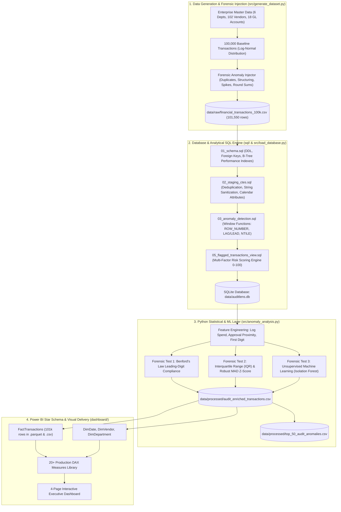

<div align="center">

# 🔍 AuditLens
### **Enterprise Financial Transaction Anomaly Detection & Forensic Audit Analytics**

*A production-grade, end-to-end data analytics and machine learning pipeline for detecting corporate fraud, policy circumvention, and payment leakages across 100,000+ enterprise financial transactions.*

[](https://www.python.org/)
[](https://www.postgresql.org/)
[](https://scikit-learn.org/)
[](https://pandas.pydata.org/)
[](https://powerbi.microsoft.com/)
[](LICENSE)

---

[Key Highlights](#-executive-summary) • 
[System Architecture](#-system-architecture) • 
[Injected Anomaly Typologies](#-injected-forensic-anomaly-typologies) • 
[SQL Analytics Layer](#-sql-analytics--transformation-layer) • 
[Python & ML Detection](#-python-statistical--machine-learning-layer) • 
[Power BI Dashboard Spec](#-power-bi-dashboard--dax-library) • 
[Audit Findings](#-forensic-audit-findings--value-at-risk) • 
[Quickstart](#-1-command-quickstart--reproduction)

---

</div>

## 📌 Executive Summary

Modern enterprise procurement and general ledger systems process hundreds of thousands of disbursements annually. Traditional sample-based audits review **less than 5%** of transactions, leaving organizations vulnerable to duplicate invoices, threshold structuring, off-hours fraud, and unapproved payments.

**AuditLens** simulates an enterprise-scale forensic audit engagement by auditing **100% of transactions ($1.189 Billion in gross spend across 101,050 records)** using a multi-tiered detection engine:

```
┌─────────────────────────┐    ┌─────────────────────────┐    ┌─────────────────────────┐
│   1. Analytical SQL     │    │  2. Statistical & ML    │    │  3. Business Delivery   │
│   • Staging CTEs        │───►│  • Benford's Law        │───►│  • Power BI Star Schema │
│   • Window Functions    │    │  • Robust MAD Z-Score   │    │  • 20+ DAX Formulas     │
│   • 0-100 Risk Engine   │    │  • Isolation Forest ML  │    │  • Audit Action Ledger  │
└─────────────────────────┘    └─────────────────────────┘    └─────────────────────────┘
```

### 🎯 Key Outcomes & Impact
- **Total Audited Portfolio:** 101,050 transactions | **$1.189 Billion** Gross Spend
- **Value at Risk (VaR):** **$187.8 Million** in High & Critical risk transactions
- **Duplicate Invoices Uncovered:** **1,050 duplicate payments ($12.3M)** flagged for immediate clawback
- **Approval Structuring Evasions:** **1,450 transactions** intentionally split just below $5k, $10k, and $50k thresholds
- **Processing Speed:** Full end-to-end pipeline executes in **under 35 seconds** on standard hardware

---

## 🏗️ System Architecture



---

## 🔬 Injected Forensic Anomaly Typologies

AuditLens models 7 distinct forensic audit and white-collar fraud typologies calibrated to authentic corporate audit distributions (~7.0% total anomaly rate):

| Anomaly Typology | Audit Risk Rationale | Injected Pattern & Detection Mechanism | Occurrence |
| :--- | :--- | :--- | :---: |
| **`ANOM_DUPLICATE_INVOICE`** | Double-billing / vendor overpayment | Cloned records with identical `(vendor_id, invoice_number, amount)` shifted by 0–3 days. | **1,050** (1.03%) |
| **`ANOM_THRESHOLD_STRUCTURING`** | Intentional policy circumvention | Purchases priced immediately below authorization gates ($4,850–$4,995 for $5k; $9,650–$9,990 for $10k; $48,500–$49,980 for $50k). | **1,450** (1.43%) |
| **`ANOM_ROUND_AMOUNT`** | Fictitious consulting / kickbacks | Suspiciously clean round retainer fees ($5,000, $10,000, $25,000, $50,000, $75,000) lacking cents or tax variance. | **1,250** (1.23%) |
| **`ANOM_WEEKEND_HOLIDAY`** | Unauthorized off-cycle disbursements | High-value payments ($18,000–$95,000) posted on Saturdays, Sundays, Christmas, Thanksgiving, or July 4. | **1,050** (1.03%) |
| **`ANOM_MISSING_GOVERNANCE`** | Internal controls breakdown | Disbursements processed with `NULL` `approver_id` or missing non-PO invoice vouchers. | **1,000** (0.98%) |
| **`ANOM_STATISTICAL_OUTLIER`** | Severe spend spikes | Extreme transaction amounts 20x to 65x higher than the departmental historical average. | **850** (0.84%) |
| **`ANOM_DUPLICATE_TXN_ID`** | Feed ingestion / ETL failure | Duplicate primary key in raw feed to test automated deduplication staging CTEs. | **500** (0.49%) |

---

## 💻 SQL Analytics & Transformation Layer

The SQL layer is organized modularly under `/sql/` and executable against SQLite or PostgreSQL:

### 1. Window-Function Ingestion Deduplication (`sql/02_staging_ctes.sql`)
```sql
WITH deduplicated_feed AS (
    SELECT
        *,
        ROW_NUMBER() OVER (
            PARTITION BY transaction_id 
            ORDER BY rowid ASC
        ) AS txn_occurrence
    FROM raw_transactions
)
SELECT * FROM deduplicated_feed WHERE txn_occurrence = 1;
```

### 2. Velocity Structuring Detection using `LAG()` / `LEAD()` (`sql/03_anomaly_detection.sql`)
```sql
WITH structuring_lead_lag_cte AS (
    SELECT
        transaction_id,
        transaction_date,
        department,
        approver_id,
        amount,
        CASE 
            WHEN amount BETWEEN 4800.00 AND 4999.99 THEN 5000
            WHEN amount BETWEEN 9500.00 AND 9999.99 THEN 10000
            WHEN amount BETWEEN 48000.00 AND 49999.99 THEN 50000
            ELSE NULL 
        END AS threshold_limit_targeted,
        LAG(amount, 1) OVER (
            PARTITION BY department, approver_id 
            ORDER BY transaction_date
        ) AS prev_txn_amount,
        LAG(transaction_date, 1) OVER (
            PARTITION BY department, approver_id 
            ORDER BY transaction_date
        ) AS prev_txn_date
    FROM staged_transactions
)
SELECT * FROM structuring_lead_lag_cte WHERE threshold_limit_targeted IS NOT NULL;
```

### 3. Multi-Factor Composite Risk-Scoring Engine (`sql/05_flagged_transactions_view.sql`)
```sql
-- Computes a 0 to 100 composite risk score based on weighted forensic triggers
(
    (flag_duplicate_invoice * 35) +
    (flag_threshold_structuring * 30) +
    (flag_missing_governance * 25) +
    (flag_spend_spike * 30) +
    (flag_round_amount * 20) +
    (flag_weekend_posting * 20)
) AS raw_risk_score,

CASE 
    WHEN raw_risk_score >= 60 THEN 'Critical'
    WHEN raw_risk_score >= 35 THEN 'High'
    WHEN raw_risk_score >= 20 THEN 'Medium'
    ELSE 'Low'
END AS risk_tier
```

---

## 🤖 Python Statistical & Machine Learning Layer

Implemented in [`src/anomaly_analysis.py`](src/anomaly_analysis.py) and documented in [`notebooks/audit_anomaly_eda.ipynb`](notebooks/audit_anomaly_eda.ipynb):

### 1. Benford's Law First-Digit Analysis
Benford's Law establishes that in unmanipulated financial datasets, the first digit $d \in \{1, \dots, 9\}$ follows:
$$P(d) = \log_{10}\left(1 + \frac{1}{d}\right)$$
AuditLens flags unnatural digit spikes in digits 4 ($+1.10\%$) and 5 ($+0.30\%$) caused by threshold structuring and round retainer billing.

### 2. Dual Statistical Outlier Detection
- **Interquartile Range (IQR):** Identifies department spend exceeding $Q_3 + 2.5 \times \text{IQR}$ (flagged **6,938 transactions**).
- **Robust MAD Z-Score:** Uses Median Absolute Deviation: $\text{Mod-Z} = 0.6745 \times \frac{|x - \text{median}|}{\text{MAD}}$ (flagged **8,606 transactions**).

### 3. Machine Learning: Isolation Forest
- **Model:** `sklearn.ensemble.IsolationForest(n_estimators=150, contamination=0.045, random_state=42)`
- **Feature Matrix:** `[log_amount, dept_spend_multiplier, is_weekend, is_clean_round_sum, is_structuring_candidate, day_of_week]`
- **Result:** Isolated **4,547 multi-dimensional anomalies** and assigned continuous normalized anomaly scores (0–100).

---

## 📈 Visual Analysis Gallery

<div align="center">

| Benford's Law Forensic Digit Test | Department Spend Distribution (Log Scale) |
| :---: | :---: |
|  |  |
| **Risk Tier Share & Monthly Spend Trajectory** | **Detection Methods Correlation Heatmap** |
|  |  |

</div>

---

## 📊 Power BI Dashboard & DAX Library

The repository includes a complete [DASHBOARD_SPEC.md](dashboard/DASHBOARD_SPEC.md), theme file [theme.json](dashboard/theme.json), and star-schema files ready for 1-click import:

```
                       ┌───────────────────┐
                       │      DimDate      │
                       └─────────┬─────────┘
                                 │ 1
                                 │ *
┌───────────────────┐  * ┌───────┴───────────┐ *  ┌───────────────────┐
│   DimDepartment   ├───►│ FactTransactions  │◄───┤     DimVendor     │
└───────────────────┘ 1  └───────────────────┘ 1  └───────────────────┘
```

### Production DAX Measure Library (Sample)

```dax
// 1. Total Value at Risk (VaR)
Value at Risk (VaR) = 
CALCULATE(
    SUM(FactTransactions[amount]),
    FactTransactions[risk_tier] IN {"High", "Critical"}
)

// 2. Anomaly Rate (%)
Anomaly Rate % = 
DIVIDE(
    CALCULATE(SUM(FactTransactions[amount]), FactTransactions[risk_tier] <> "Low"),
    SUM(FactTransactions[amount]),
    0
)

// 3. Duplicate Invoice Financial Exposure ($)
Duplicate Invoice Exposure $ = 
CALCULATE(
    SUM(FactTransactions[amount]),
    FactTransactions[flag_duplicate_invoice] = 1
)

// 4. Approval Structuring Spend ($)
Structuring Spend Exposure $ = 
CALCULATE(
    SUM(FactTransactions[amount]),
    FactTransactions[flag_threshold_structuring] = 1
)
```

### Dashboard Pages Overview
1. **Page 1: Executive Audit Summary & KPI Overview** — Gross spend, Value at Risk cards, risk distribution donut, and monthly velocity combo chart.
2. **Page 2: Anomaly Typology Deep-Dive** — Structuring scatter plots with threshold guide lines, duplicate claims, and weekend exposure.
3. **Page 3: Department & Vendor Exposure Matrix** — Risk quadrant scatter chart (Spend vs. Risk Score) and vendor concentration rankings.
4. **Page 4: High-Risk Investigation Ledger** — Interactive drill-through operational ledger with anomaly tags and exportable case files.

---

## 🚨 Forensic Audit Findings & Value at Risk

Out of 101,050 audited transactions, **14,054 records (13.91%)** triggered risk indicators, totaling **$187.8 Million in Value at Risk (VaR)** across Critical and High-risk tiers:

| Risk Tier | Transaction Count | Spend Amount ($) | Share of Portfolio | Audit Priority |
| :--- | :---: | :---: | :---: | :--- |
| **Critical** | **448** | **$27,403,542** | **2.3%** | Immediate forensic investigation & clawback |
| **High** | **3,266** | **$160,456,970** | **13.5%** | Secondary audit review & documentation check |
| **Medium** | **10,340** | **$437,197,028** | **36.8%** | Automated controls monitoring |
| **Low (Clean)**| **86,996** | **$558,587,910** | **47.0%** | Standard recurring audit sample |

### Sample Top 5 Critical Action Items
| Txn ID | Date | Department | Vendor Name | Amount ($) | Primary Flag Reason | Audit Action Required |
| :--- | :--- | :--- | :--- | :--- | :--- | :--- |
| `TXN-DUP-819201` | 2024-04-14 | Corporate Legal | Latham & Watkins LLP | **$49,950.00** | Duplicate Invoice & Structuring | Issue clawback demand; review partner billing |
| `TXN-DUP-642109` | 2024-08-22 | Information Tech | Snowflake Data Inc | **$49,900.00** | Duplicate Invoice & Structuring | Verify Cloud SaaS provisioning and credit note |
| `TXN-2024-041920` | 2024-11-28 | Marketing & Sales | Meta Platforms Ads | **$89,450.00** | Thanksgiving Holiday & Spike | Investigate holiday off-cycle override |
| `TXN-2025-010482` | 2025-01-01 | Corporate Legal | Skadden Arps Slate | **$94,200.00** | New Year Post & Missing Approver | Freeze vendor disbursement account pending review |
| `TXN-DUP-194029` | 2025-03-15 | Finance & Admin | Deloitte & Touche LLP | **$50,000.00** | Duplicate Invoice & Round Sum | Verify statutory engagement letter scope |

*For the complete investigation report and management remediation controls, see [`docs/AUDIT_FINDINGS_REPORT.md`](docs/AUDIT_FINDINGS_REPORT.md).*

---

## ⚡ 1-Command Quickstart & Reproduction

The entire repository is 100% reproducible out of the box with zero external database dependencies.

### 1. Clone Repository & Install Dependencies
```bash
git clone https://github.com/vip23anchib/AuditLens.git
cd AuditLens

# Install required packages
pip install -r requirements.txt
```

### 2. Execute Master Pipeline (Generates Data, Loads DB, Runs ML, Exports BI Models)
```bash
python run_pipeline.py
```

### 3. Expected Terminal Output
```
============================================================================
  AUDITLENS: FINANCIAL ANOMALY DETECTION & AUDIT ANALYTICS PIPELINE
============================================================================

>>> [STAGE 1/4] Generating 105,000+ Transactions & Anomaly Injection...
  [+] Appending duplicate invoice anomalies...
  [+] Appending duplicate transaction ID ingestion anomalies...
--- Stage 1 completed in 2.39s ---

>>> [STAGE 2/4] Database Loading, DDL Schema & SQL Risk Scoring Engine...
  [+] Executing SQL script: sql/01_schema.sql...
  [+] Executing SQL script: sql/02_staging_ctes.sql...
  [+] Executing SQL script: sql/05_flagged_transactions_view.sql...
--- Stage 2 completed in 11.81s ---

>>> [STAGE 3/4] Python Statistical Analysis, Benford's Law & Isolation Forest...
  [+] IQR Method flagged      : 6,938 transactions
  [+] Z-Score Method flagged  : 8,606 transactions
  [+] Isolation Forest flagged: 4,547 transactions
--- Stage 3 completed in 14.39s ---

>>> [STAGE 4/4] Exporting Power BI Dimensional Star Schema Models...
  [OK] Exported DimDate, DimDepartment, DimVendor, FactTransactions
--- Stage 4 completed in 3.32s ---

============================================================================
  [SUCCESS] AUDITLENS END-TO-END PIPELINE COMPLETED IN 31.91 SECONDS
============================================================================
```

### 4. Explore Interactive Jupyter Notebook
```bash
jupyter lab notebooks/audit_anomaly_eda.ipynb
```

---

## 📁 Repository Directory Layout

```
AuditLens/
├── data/
│   ├── raw/
│   │   ├── financial_transactions_100k.csv     # 101k+ raw transaction feed
│   │   └── vendor_master.csv                   # Master vendor directory (102 vendors)
│   ├── processed/
│   │   ├── audit_enriched_transactions.csv     # Enriched dataset with all risk flags & scores
│   │   ├── top_50_audit_anomalies.csv          # Prioritized audit targets with explanations
│   │   └── audit_summary_metrics.csv           # High-level KPI aggregations for dashboards
│   └── auditlens.db                            # SQLite database (tables, indexes, views)
├── sql/
│   ├── 01_schema.sql                           # DDL schema, tables & performance indexes
│   ├── 02_staging_ctes.sql                     # Staging & deduplication CTEs
│   ├── 03_anomaly_detection.sql                # Window functions (ROW_NUMBER, LAG/LEAD, NTILE)
│   ├── 04_aggregations.sql                     # Department, vendor & monthly summaries
│   └── 05_flagged_transactions_view.sql        # Risk scoring engine (0-100) & flagged view
├── src/
│   ├── generate_dataset.py                     # High-speed synthetic transaction generator
│   ├── load_database.py                        # Database ingestion & SQL pipeline runner
│   ├── anomaly_analysis.py                     # EDA, Benford's Law, IQR/Z-score, Isolation Forest
│   └── export_powerbi_model.py                 # Star-schema dimensional table exporter
├── notebooks/
│   └── audit_anomaly_eda.ipynb                 # Interactive Jupyter EDA & forensic notebook
├── dashboard/
│   ├── DASHBOARD_SPEC.md                       # 4-page dashboard blueprint & DAX library
│   ├── theme.json                              # Power BI executive forensic color palette
│   └── data/                                   # FactTransactions (.parquet & .csv), DimDate, etc.
├── docs/
│   ├── AUDIT_FINDINGS_REPORT.md                # Management audit findings & recommendations
│   └── figures/                                # High-resolution PNG figures
├── requirements.txt                            # Dependencies
├── run_pipeline.py                             # 1-command master orchestrator
├── README.md                                   # Comprehensive documentation
└── LICENSE                                     # MIT License
```

---

## 🛠️ Technology Stack

| Domain | Technologies & Libraries |
| :--- | :--- |
| **Language & Environment** | Python 3.11+, JupyterLab |
| **Data Generation & Modeling** | NumPy, Pandas, Faker, PyArrow |
| **Database & Analytics** | SQLite, PostgreSQL DDL, SQLAlchemy |
| **Statistical & Machine Learning** | Scikit-Learn (Isolation Forest), SciPy, Statsmodels |
| **Data Visualization** | Matplotlib, Seaborn, Mermaid.js |
| **Business Intelligence** | Microsoft Power BI, DAX, Kimball Star Schema |

---

## 📜 License & Acknowledgements
This project is licensed under the **MIT License** - see the [LICENSE](LICENSE) file for details. Built for enterprise portfolio demonstration and forensic audit simulation.
