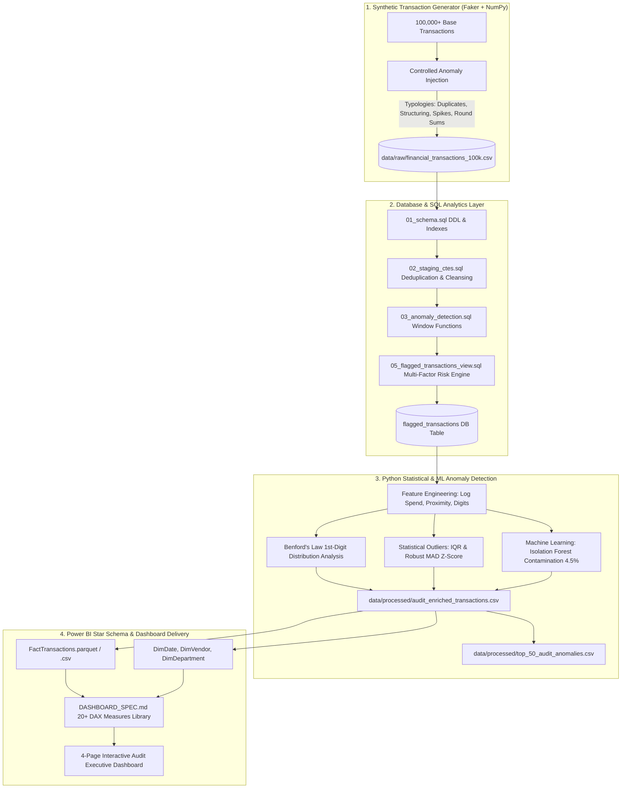
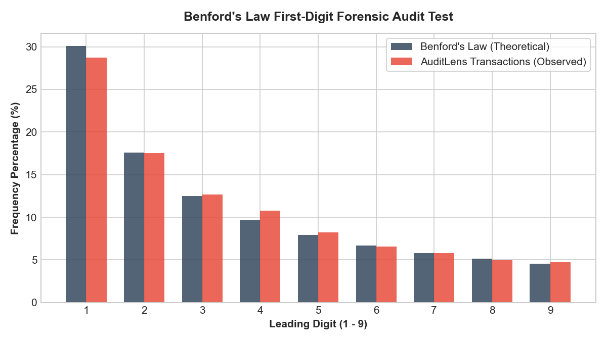
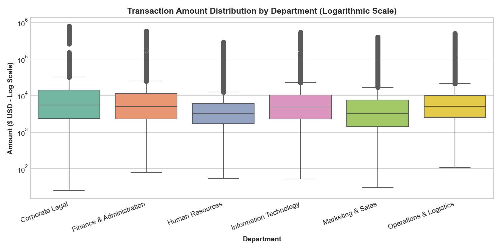
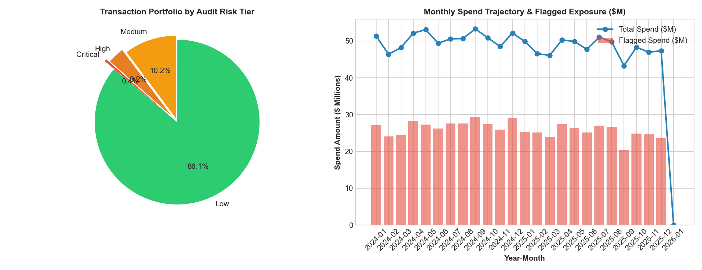
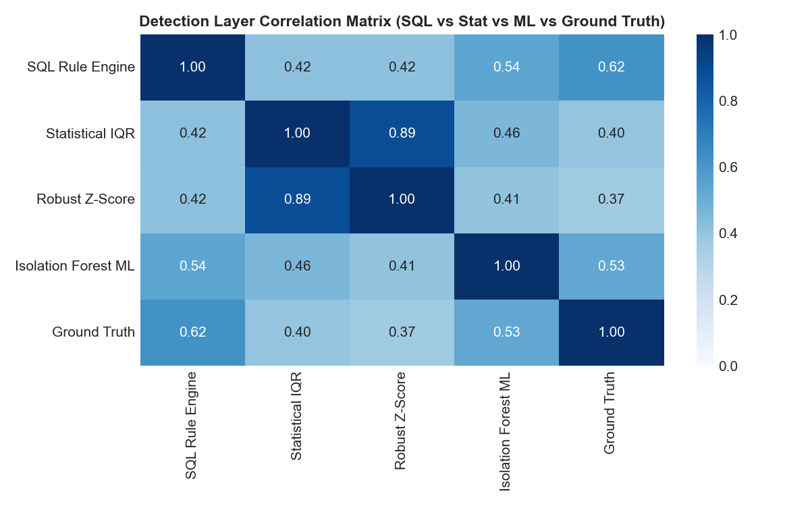

# AuditLens: Financial Transaction Anomaly Detection & Forensic Audit Analytics Dashboard

[](https://www.python.org/)
[](https://www.postgresql.org/)
[](https://scikit-learn.org/)
[](https://powerbi.microsoft.com/)
[](LICENSE)

**AuditLens** is an enterprise-grade financial audit analytics pipeline that simulates a real-world internal audit and forensic accounting engagement. It ingests **101,000+ realistic corporate transactions ($1.18B spend)**, applies multi-stage analytical SQL transformations, deepens the investigation with statistical profiling (IQR, Robust Z-Score, Benford's Law) and Unsupervised Machine Learning (**Isolation Forest**), and exports structured star-schema datasets with production-ready **DAX measures** for Power BI.

---

## 🏗️ System Architecture & Workflow



---

## 🎯 Injected Forensic Anomaly Typologies

AuditLens simulates 7 specific corporate financial fraud and compliance failure typologies calibrated to authentic internal audit frequencies (~7.0% overall anomaly rate):

| Anomaly Typology | Audit Risk Rationale | Injected Pattern & Mechanism |
| :--- | :--- | :--- |
| **`ANOM_DUPLICATE_INVOICE`** | Double-billing / Overpayment fraud | Identical vendor, invoice number, amount posted within 0-3 days. |
| **`ANOM_THRESHOLD_STRUCTURING`** | Policy circumvention / Split purchases | Successive disbursements priced just under authorization limits ($4,950 vs $5k; $9,900 vs $10k; $49,850 vs $50k). |
| **`ANOM_ROUND_AMOUNT`** | Fictitious consulting / Kickback retainers | Suspiciously clean round payments ($5,000, $10,000, $25,000, $50,000) lacking itemized deliverables. |
| **`ANOM_WEEKEND_HOLIDAY`** | Unauthorized off-cycle disbursements | High-value payments (> $15,000) posted on Sundays, Saturdays, Christmas, Thanksgiving, July 4. |
| **`ANOM_MISSING_GOVERNANCE`** | Internal control breakdown | Missing or `NULL` approver IDs and non-PO emergency vouchers. |
| **`ANOM_STATISTICAL_OUTLIER`** | Severe spend spikes | Transaction amounts > 5x to 15x standard deviations above departmental historical mean. |
| **`ANOM_DUPLICATE_TXN_ID`** | Feed integrity / ETL failure | Duplicate primary key in raw feed to test automated deduplication staging CTEs. |

---

## 📊 Analytics & Machine Learning Stack

### 1. SQL Transformation & Risk Engine (`/sql/`)
- **Staging & Deduplication:** `ROW_NUMBER() OVER (PARTITION BY transaction_id ORDER BY rowid)`
- **Sequence Tracking:** `LAG()` and `LEAD()` across rolling windows to detect velocity structuring.
- **Percentile Profiling:** `NTILE(100)` and `PERCENT_RANK()` by department.
- **Composite Risk Score (0-100):** Weighted multi-factor CASE scoring categorizing transactions into **Low (<20)**, **Medium (20-34)**, **High (35-59)**, and **Critical (60+)** risk tiers.

### 2. Statistical & Forensic Methods (`/src/anomaly_analysis.py`)
- **Benford's Law First-Digit Analysis:** Compares empirical digit frequency against theoretical $P(d) = \log_{10}(1 + 1/d)$ to expose manual amounts.
- **Interquartile Range (IQR):** Identifies amounts exceeding $Q_3 + 2.5 \times \text{IQR}$ per department.
- **Robust Modified Z-Score (MAD):** Resistant to extreme distortion using $0.6745 \times \frac{|x - \text{median}|}{\text{MAD}}$.

### 3. Machine Learning: Isolation Forest
- **Algorithm:** Scikit-Learn `IsolationForest` ($n=150$ estimators, contamination=4.5%).
- **Engineered Features:** `log_amount`, `dept_spend_multiplier`, `is_weekend`, `is_clean_round_sum`, `is_structuring_candidate`, `day_of_week`.
- **Outputs:** High-dimensional anomaly score (0-100) and ML anomaly flags.

---

## 📈 Visual Gallery

| Benford's Law Forensic Analysis | Spend Distribution by Department |
| :---: | :---: |
|  |  |
| **Portfolio Risk Tiers & Monthly Velocity** | **Detection Methods Correlation Matrix** |
|  |  |

---

## 📑 Power BI Dashboard Specification & DAX Library

The repository includes a comprehensive [DASHBOARD_SPEC.md](dashboard/DASHBOARD_SPEC.md) outlining:
- **4 Dedicated Dashboard Pages:**
  1. **Executive Audit Summary & KPI Overview** (Total Spend, Value at Risk, Anomaly Rate %, Critical Counts).
  2. **Anomaly Typology Deep Dive** (Structuring scatter plots, duplicate claims, weekend exposure).
  3. **Department & Vendor Exposure Matrix** (Quadrant risk chart, vendor risk concentration).
  4. **High-Risk Transaction Investigation Ledger** (Operational audit drill-through workbench).
- **20+ Copy-Paste Ready DAX Measures:**

```dax
// Example: Value at Risk (VaR)
Value at Risk (VaR) = 
CALCULATE(
    SUM(FactTransactions[amount]),
    FactTransactions[risk_tier] IN {"High", "Critical"}
)
```

---

## 🚀 Quickstart & One-Command Reproduction

### 1. Clone & Setup Environment
```bash
git clone https://github.com/vip23anchib/AuditLens.git
cd AuditLens

# Create virtual environment (optional)
python -m venv venv
# Activate on Windows:
.\venv\Scripts\activate
# Activate on Linux/macOS:
source venv/bin/activate

# Install dependencies
pip install -r requirements.txt
```

### 2. Execute Complete Pipeline (1 Command)
Run the automated end-to-end master runner:
```bash
python run_pipeline.py
```

### 3. Run Interactive Jupyter Notebook
```bash
jupyter lab notebooks/audit_anomaly_eda.ipynb
```

---

## 📁 Repository Structure

```
AuditLens/
├── data/
│   ├── raw/                           # Raw synthetic transaction feed & vendor master
│   │   ├── financial_transactions_100k.csv
│   │   └── vendor_master.csv
│   ├── processed/                     # Enriched datasets and top anomaly action items
│   │   ├── audit_enriched_transactions.csv
│   │   ├── audit_summary_metrics.csv
│   │   └── top_50_audit_anomalies.csv
│   └── auditlens.db                   # SQLite database (auto-generated)
├── sql/
│   ├── 01_schema.sql                  # Database DDL, tables, and performance indexes
│   ├── 02_staging_ctes.sql            # Cleansing, date derivation, and deduplication CTEs
│   ├── 03_anomaly_detection.sql       # Window functions (ROW_NUMBER, LAG/LEAD, NTILE)
│   ├── 04_aggregations.sql            # Department, vendor, and monthly spend summaries
│   └── 05_flagged_transactions_view.sql # Risk scoring engine (0-100) & flagged view
├── src/
│   ├── generate_dataset.py            # High-speed synthetic transaction generator
│   ├── load_database.py               # Database ingestion & SQL pipeline runner
│   ├── anomaly_analysis.py            # EDA, Benford's Law, IQR/Z-score, Isolation Forest
│   └── export_powerbi_model.py        # Power BI star-schema exporter
├── notebooks/
│   └── audit_anomaly_eda.ipynb        # Interactive Jupyter EDA & forensic audit notebook
├── dashboard/
│   ├── DASHBOARD_SPEC.md              # 4-page dashboard blueprint, DAX library, visuals
│   ├── theme.json                     # Enterprise forensic Power BI theme
│   └── data/                          # Star-schema tables (FactTransactions, DimDate, etc.)
├── docs/
│   ├── AUDIT_FINDINGS_REPORT.md       # Executive forensic audit investigation report
│   └── figures/                       # High-resolution audit visualization figures
├── requirements.txt                   # Project dependencies
├── run_pipeline.py                    # Master 1-command end-to-end orchestrator
└── README.md                          # Comprehensive documentation
```

---

## 🔍 Key Audit Findings Summary

| Total Transactions | Gross Portfolio Spend | Flagged Risk Exposure | Value at Risk (High/Critical) | Duplicate Invoices |
| :---: | :---: | :---: | :---: | :---: |
| **101,050** | **$1.189 Billion** | **14,054 (13.91%)** | **$187.8 Million** | **1,050 ($12.3M)** |

For full executive findings, root causes, and remediation recommendations, see [docs/AUDIT_FINDINGS_REPORT.md](docs/AUDIT_FINDINGS_REPORT.md).

---

## 📄 License
This project is licensed under the MIT License - see the [LICENSE](LICENSE) file for details.
